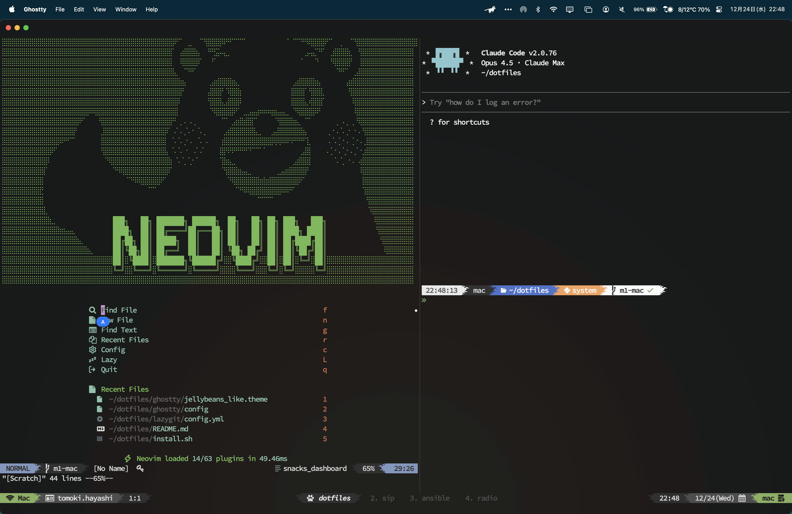

# Dotfiles

My dotfiles for macOS.



## Requirements

- git
- brew

## Setup

1. Get Nerd fonts from <https://github.com/ryanoasis/nerd-fonts>
2. Setup dotfiles and install software as follow

  ```bash
  # clone this repository
  $ git clone https://github.com/kan-bayashi/dotfiles -b m1-mac
  $ cd dotfiles

  # setup dotfiles
  $ ./setup.sh

  # install tools
  $ ./install.sh

  # enable zsh environment
  $ exec zsh -l
  ```

## References

- nerd font: [ryanoasis/nerd-fonts](https://github.com/ryanoasis/nerd-fonts)
- zsh theme: [caiogondim/bullet-train.zsh](https://github.com/caiogondim/bullet-train.zsh)
