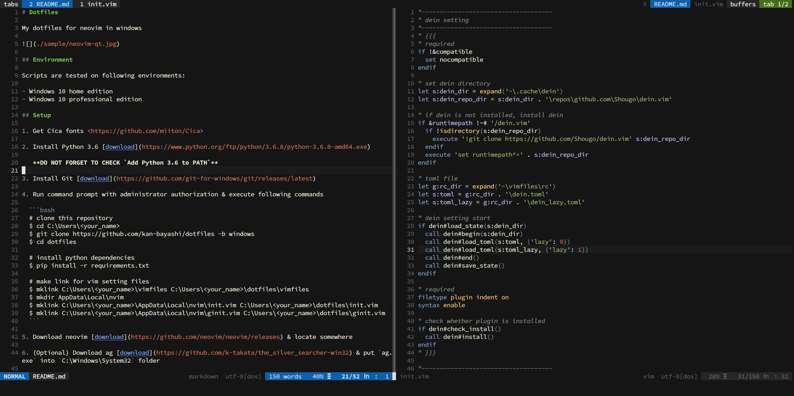

# Dotfiles

My dotfiles for neovim in windows



## Environment

Scripts are tested on following environments:

- Windows 10 home edition
- Windows 10 professional edition

## Setup

1. Get Cica fonts <https://github.com/miiton/Cica>

2. Install Python 3.6 [download](https://www.python.org/ftp/python/3.6.8/python-3.6.8-amd64.exe)  
   **DO NOT FORGET TO CHECK `Add Python 3.6 to PATH`**

3. Install Git [download](https://github.com/git-for-windows/git/releases/latest)

4. Run command prompt with administrator authorization & execute following commands

  ```bash
  # clone this repository
  $ cd C:\Users\<your_name>
  $ git clone https://github.com/kan-bayashi/dotfiles -b windows
  $ cd dotfiles

  # install python dependencies
  $ pip install -r requirements.txt

  # make link for vim setting files
  $ mklink C:\Users\<your_name>\vimfiles C:\Users\<your_name>\dotfiles\vimfiles
  $ mkdir AppData\Local\nvim
  $ mklink C:\Users\<your_name>\AppData\Local\nvim\init.vim C:\Users\<your_name>\dotfiles\init.vim
  $ mklink C:\Users\<your_name>\AppData\Local\nvim\ginit.vim C:\Users\<your_name>\dotfiles\ginit.vim
  ```

5. Download neovim [download](https://github.com/neovim/neovim/releases) & locate somewhere

6. (Optional) Download ag [download](https://github.com/k-takata/the_silver_searcher-win32) & put `ag.exe` into `C:\Windows\System32` folder

7. Run `nvim-qt.exe`

> Require time for the first time to install plugins

## References

- nerd font: [ryanoasis/nerd-fonts](https://github.com/ryanoasis/nerd-fonts)
