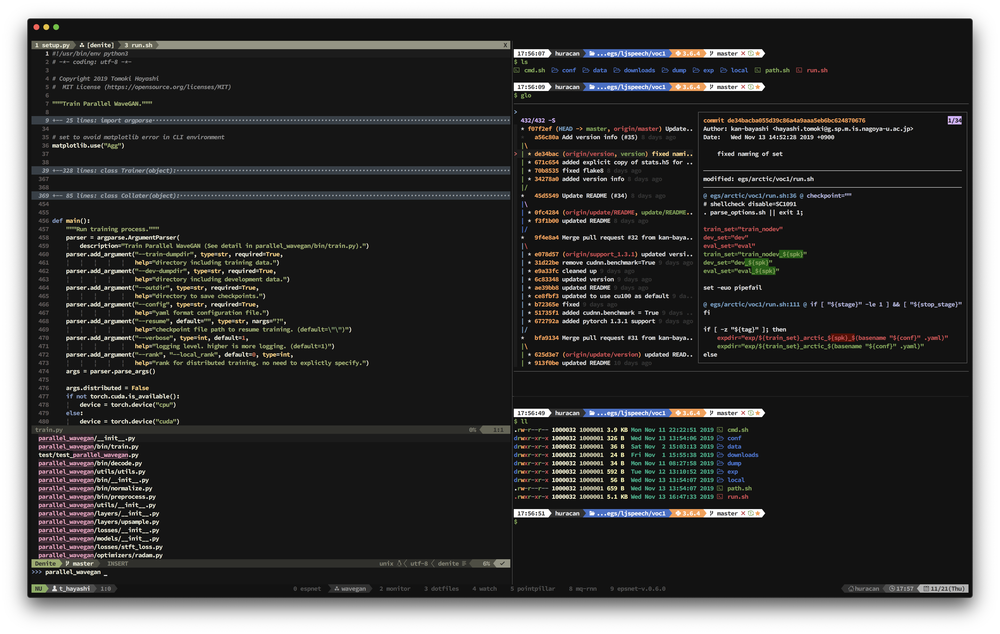

# Dotfiles

My dotfiles (zsh + tmux 2.6 + vim 8 or nvim)



## Requirements

- zsh

## How-to-install

1. Get Nerd fonts from <https://github.com/ryanoasis/nerd-fonts>
2. If use iterm2, install `iterm2/jellybeans_like.itermcolors`
3. Setup dotfiles and install software as follow

```bash
# clone this repository
$ git clone https://github.com/kan-bayashi/dotfiles
$ cd dotfiles

# setup dotfiles
$ ./setup.sh

# install softwares
$ ./install.sh

# install vim plugins
$ vim
$ nvim
```

## References

- nerd font: [ryanoasis/nerd-fonts](https://github.com/ryanoasis/nerd-fonts)
- zsh theme: [caiogondim/bullet-train.zsh](https://github.com/caiogondim/bullet-train.zsh)
